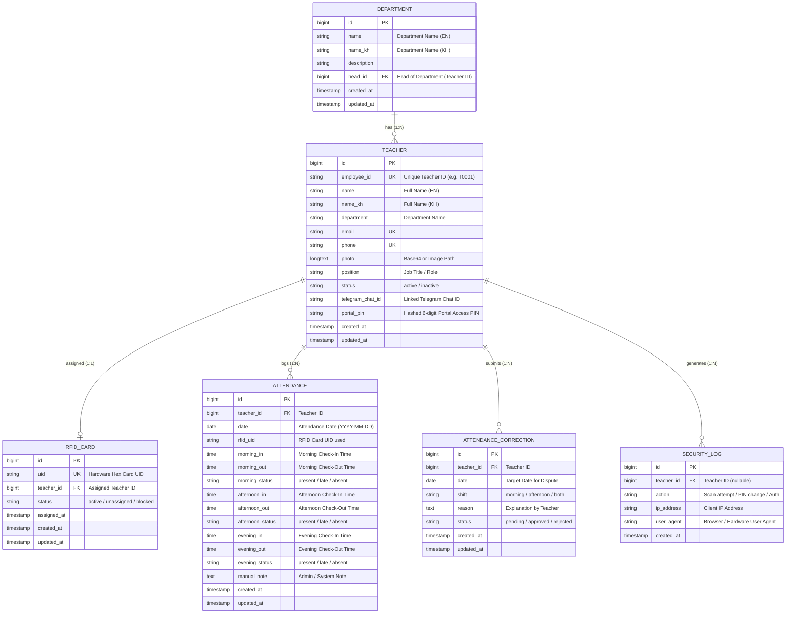

# NTTI Teacher Attendance System - Database Schema & ER Diagram Prototype

This document presents the complete database schema design, entity relationship analysis, and Mermaid ER diagram prototype for the NTTI Teacher Attendance System.

---

## 1. Entity Relationship (ER) Diagram

---

## 2. Table Structures & Primary / Foreign Keys

### Table 1: `teachers`
- **Primary Key:** `id`
- **Unique Keys:** `employee_id`, `email`, `phone`
- **Description:** Stores core profiles of teachers, contact details, Telegram notifications chat ID, and encrypted PIN for portal login.

### Table 2: `attendance`
- **Primary Key:** `id`
- **Foreign Key:** `teacher_id` $\rightarrow$ `teachers(id)` (ON DELETE CASCADE)
- **Unique Constraint:** `(teacher_id, date)` - Ensures only **one row per teacher per calendar date**.
- **Description:** Tracks morning, afternoon, and evening shift scans (`check-in` and `check-out` timestamps) along with status flags (`present`, `late`, `absent`).

### Table 3: `rfid_cards`
- **Primary Key:** `id`
- **Foreign Key:** `teacher_id` $\rightarrow$ `teachers(id)` (ON DELETE SET NULL / CASCADE)
- **Unique Key:** `uid`
- **Description:** Maps physical 13.56MHz RFID card hex UIDs to registered teachers.

### Table 4: `departments`
- **Primary Key:** `id`
- **Foreign Key:** `head_id` $\rightarrow$ `teachers(id)` (Nullable)
- **Description:** Stores department master data (in English and Khmer).

### Table 5: `attendance_corrections`
- **Primary Key:** `id`
- **Foreign Key:** `teacher_id` $\rightarrow$ `teachers(id)`
- **Description:** Handles missing scan disputes and manual correction requests submitted via the Teacher Portal.

---

## 3. Detailed Relationship Summary

| Primary Table | Related Table | Relationship Type | Key Connection | Description |
| :--- | :--- | :--- | :--- | :--- |
| **Teacher** | **Attendance** | **One-to-Many (1:N)** | `teachers.id` = `attendance.teacher_id` | One teacher accumulates multiple daily attendance records over time. |
| **Teacher** | **RFID Card** | **One-to-One (1:1)** | `teachers.id` = `rfid_cards.teacher_id` | One active RFID card is assigned to one specific teacher. |
| **Department**| **Teacher** | **One-to-Many (1:1/N)**| `departments.name` = `teachers.department` | One department has many teachers. |
| **Teacher** | **Correction** | **One-to-Many (1:N)** | `teachers.id` = `attendance_corrections.teacher_id` | One teacher can submit multiple correction requests for missed scans. |

---

## 4. Defense Presentation Speaking Script (Database Section)

> *"Honorable Committee Members,*
>
> *Our system utilizes a **Relational Database Model (RDBMS)** built on MySQL. The core database schema is structured around **One-to-Many (1:N)** and **One-to-One (1:1)** relationships.*
>
> *1. **Data Consistency:** By placing strict foreign key constraints between `teachers` and `attendance`, we eliminate orphan records and ensure data integrity.*
> *2. **Single Row Per Day Optimization:** Instead of inserting new rows for every single tap on the RFID reader, our schema updates shift columns (`morning_in`, `morning_out`, `afternoon_in`, `afternoon_out`) within a single daily record per teacher. This drastically reduces query execution time when generating monthly reports.*
> *3. **Security:** Sensitive fields like `portal_pin` are encrypted, and hardware card `uid` fields are uniquely indexed to prevent duplicate badge assignments."*
