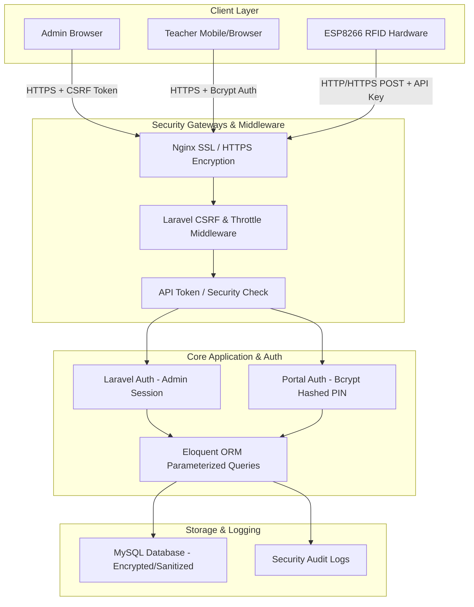

# NTTI Teacher Attendance System - System Security Architecture Analysis

This document provides a comprehensive security analysis for the NTTI Teacher Attendance System, covering Frontend, Backend, Database, Hardware (IoT), and Infrastructure security for defense presentation.

---

## 1. Security Architecture Diagram

---

## 2. Comprehensive Security Analysis

### A. Authentication & Password Security
- **Bcrypt Password & PIN Hashing:** 
  - Admin passwords and Teacher 6-digit Portal PINs are hashed using PHP's `Bcrypt` algorithm via Laravel's `Hash::make()`.
  - Plaintext PINs are never stored in the database.
- **Model Attribute Protection:**
  - The `Teacher` model includes `protected $hidden = ['portal_pin'];` to prevent sensitive access credentials from being exposed in JSON API responses.
- **Session Isolation:**
  - Separate authentication guards prevent Teacher Portal sessions from accessing Admin Dashboard capabilities.

---

### B. Hardware & API Security (ESP8266 + RFID)
- **API Secret Validation:**
  - The hardware scanner sends requests to the `/api/scan` endpoint accompanied by a pre-shared hardware token.
- **Scan Cooldown / Replay Attack Mitigation:**
  - The backend enforces a 60-second cooldown period per card. Duplicate scans in quick succession are ignored to prevent database spamming or malicious replay attacks.
- **Unassigned Card Auditing:**
  - If an unregistered card is tapped on the reader, the system logs the attempt in `security_logs` with IP, timestamp, and card UID for administrative review rather than crashing or revealing internal errors.

---

### C. Web Application Protection (OWASP Top 10 Safeguards)
1. **SQL Injection (SQLi) Prevention:**
   - **Protection:** All queries utilize Laravel's Eloquent ORM and PDO parameter binding. User input is never concatenated directly into raw SQL queries.
2. **Cross-Site Scripting (XSS) Prevention:**
   - **Protection:** Blade templating automatically sanitizes and escapes HTML output using `{{ $variable }}` (`htmlspecialchars`), blocking malicious script injection.
3. **Cross-Site Request Forgery (CSRF) Prevention:**
   - **Protection:** All web forms and AJAX submit requests require a valid cryptographic `_token` header. Unauthenticated or tampered POST requests are rejected (419 Status Code).
4. **Rate Limiting & Anti-Brute-Force:**
   - **Protection:** Login routes utilize rate-limiting middleware (`throttle:login`) to prevent automated dictionary attacks on admin passwords and portal PINs.

---

### D. Infrastructure & Data In Transit
- **SSL / TLS Encryption:**
  - Production traffic on Vultr VPS (`66.42.61.106`) is served over HTTPS using SSL certificates, ensuring data transmitted between browsers, hardware scanners, and the server is encrypted.
- **Environment Isolation (`.env`):**
  - Sensitive environment configurations (Database passwords, App secret key, Telegram Bot Token) are stored exclusively in `.env` files outside the web root directory and excluded from Git version control.

---

## 3. Defense Speaking Script (Security Section)

> *"Honorable Defense Committee Members,*
>
> *Security was built into the core design of our attendance system following industry standards:*
>
> *1. **Hardware Integrity:** The ESP8266 scanner authenticates every tap request with a security key, and our rate-limiting cooldown prevents replay attacks.*
> *2. **Data Protection:** We protect user credentials by hashing 6-digit Portal PINs with Bcrypt and hiding sensitive keys in JSON exports.*
> *3. **OWASP Compliance:** By using Laravel's Eloquent ORM and Blade templating, the system is natively protected against SQL Injection, XSS, and CSRF attacks."*
